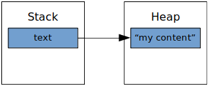
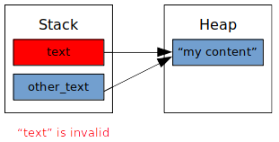

# rust-memo

A personal memo about all the basic stuffs to know about the Rust language. Useful when I code...

## Sources

Simplified list of Rust basic features (and benefits!) written
using the official Rust documentation (https://doc.rust-lang.org/book/second-edition).

## Compile the examples

```sh
cd example_folder/
cargo run
```

## Table of contents
- [Variables and mutability](#variables-and-mutability)
- [Constants](#constants)
- [Shadowing](#shadowing)
- [Scalar types](#scalar-types)
- [Compound types](#compound-types)
- [Statements and expressions](#statements-and-expressions)
- [Ownership](#ownership)
    * [The rules of ownership](#the-rules-of-ownership)
    * [Move semantics](#move-semantics)
    * [Copy instead of move](#copy-instead-of-move)
    * [`Copy` trait](#copy-trait)
    * [Function call](#function-call)
- [References](#references)
    * [The rules for references](#the-rules-for-references)
    * [Mutable reference](#mutable-reference)
    * [Immutable reference](#immutable-reference)
    * [Invalid references](#invalid-references)
    * [Borrowing](#borrowing)
- [Lifetimes](#lifetimes)
    * [Concept](#concept)
    * [The problem](#the-problem)
    * [References lifetimes into functions declarations](#references-lifetimes-into-functions-declarations)
    * [References lifetimes into structures](#references-lifetimes-into-structures)
    * [References lifetimes into implementations](#references-lifetimes-into-implementations)
    * [`'static` lifetime](#static-lifetime)
- [`const` vs `static`](#const-vs-static)
- [Generic types](#generic-types)
    * [Generic types on functions](#generic-types-on-functions)
    * [Generic types on structures](#generic-types-on-structures)
    * [Generic types on implementations](#generic-types-on-implementations)
    * [Generic types with enumerations](#generic-types-with-enumerations)
- [Trait bounds](#trait-bounds)
- [Closures](#closures)
- [Smart pointers](#smart-pointers)
    * [`Box<T>` stores the data on the heap](#box<t>-stores-the-data-on-the-heap)
    * [`Deref`](#deref)
    * [`Drop`](#drop)
    * [`Rc`](#rc)
- [Threads](#threads)
- [Messaging](#messaging)
- [Mutex](#mutex)

## Variables and mutability
Check the project `variables_and_mutability`.

To remember:
* every variable is immutable by default, declare them with `mut` to make them mutable,
* if an object is immutable, that means all its attributes are immutable,
* if an array is immutable, that means all its items are immutable,
* variables declared with `let` cannot be declared into the global scope

Benefits:
* you know what variable might be modified or not,
* by default, a variable cannot be modified, it prevents bad surprises
if a part of the program accidently tries to change the variable,
especially when using multiple threads.

## Constants
Check the project `constants`.

To remember:
* when declaring a constant, the data type is mandatory,
* a constant is computed at compilation, so Rust must be able to deduce its value during the compilation,
* a constant can be declared as global,
* a constant can be built from raw values, from another constant, from `const fn` functions,
* `const fn` functions are evaluated at compilation time and cannot declare `let` variables

Benefits:
* give an explicit name to raw values instead of losing insignificant digits, strings... in the code,
* you only need to modify the constant declaration value in order to modify its value everywhere it is used,
* explicitly calculate a value at compilation-time and not at runtime

## Shadowing
Check the project `shadowing`.

To remember:
* "shadow" a variable means create another variable with the same name, calling this name means getting the second variable value,
* shadowing can be performed with totally different types between the shadowed variables

Benefits:
* stop variables mutability (or start variables mutability),
* limit the amount of variables

## Scalar types
Check the project `scalar_types`.

To remember:
* "scalar" types are integers (u8, i8, u16, i16, u32, i32, u64, i64, usize, isize),
floating-point numbers (f32, f64), booleans (bool) and characters,
* "usize" and "isize" size depends of the architecture (32 bits long or 64 bits long),
* if the type is not specified when declaring an integer variable, the default type is `i32`,
(BEWARE: Rust does not switch to i64/u64 if the value is too high for i32,
it adapts it in order to store it into the i32, a warning is raised though)
* f32 and f64 use IEEE-754 standard (https://en.wikipedia.org/wiki/IEEE_754),
f32 has a single precision, f64 has a double precision,
* char is four bytes long, and can store any unicode scalar value (http://www.unicode.org/glossary/#unicode_scalar_value),

Benefits:
* "usize" gives the guarantee to be always good enough to hold any pointer

## Compound types
Check the project `compound_types`.

To remember:
* there are two compound types: tuples and arrays,
* a tuple can have different data types, an array cannot have different data types,
* a tuple types can be implicit or explicit,
* array items are accessed using `array[index]` notation, tuples items are accessed using `tuple.index` notation,
* arrays and tuples are affected by mutability and the `mut` keyword
* arrays are simple chunks of memory allocated on the stack,
* arrays and tuples have a fixed size, on arrays, that size may be implicit or explicit

## Statements and expressions
Check the project `statements_and_expressions`.

To remember:
* a `statement` is a code instruction that does not return a value,
an `expression` is a code instruction that returns a value,
* declaring a variable with `let` is a statement, defining a function is also a statement,
* statements contains expressions, expressions are defined with blocks (`{}`),
* expression that returns nothing return an unit type (`()`) (counterpart of `void` in C),
* statements end with a semicolon, expressions have no semicolon at the end

## Ownership
Check the project `ownership`.

### The rules of ownership

The three rules of ownership in Rust:

```
- Each value in Rust has a variable that’s called its owner.
- There can only be one owner at a time.
- When the owner goes out of scope, the value will be dropped.
```

### Move semantics

The following situation happens to objects
that are allocated on the heap memory.

```rust
let text = String::from("my content");
let other_text = text;

// "text" is not callable anymore, its stack part has been copied
// into an "other_text" variable, the heap part is unchanged,
// the previous stack part ("text") cannot be accessed anymore
```

In the example above, a `String` is allocated on the heap.
Meta-data of the string is allocated on the stack,
including a pointer to the heap allocation.

When `other_text` is declared from `text`, the stack part of the object
is copied and is now accessible through `other_text`.
The heap allocated data is not affected.



As a value can only have one owner at a time, `other_text` becomes the owner
and `text` cannot be used anymore.



### Copy instead of move

The following situation happens to objects
that are allocated on the heap memory.

```rust
let text = String::from("my content");
let other_text = text.clone();
```

In the example above, both of the stack and heap memory
is copied and a brand new variable is created.
Both `text` and `other_text` are accessible within the context.

### `Copy` trait

Most of the types that do not require to set any data on the heap memory
(and that only live on the stack memory) generally implement the `Copy` trait.

This trait makes the variables from those types to be copied by default.
This is the case for all the scalar types.

```rust
let x = 5;
let y = x;
println!("{}", x); // 5
println!("{}", y); // 0
```

### Function call

Exactly the same situation happens when a variable is passed to function.
If the variable has heap memory allocation, the variable is moved and won't
be accessible anymore from the client scope.
If the variable has stack memory allocation only, the variable is copied
(if it implements the `Copy` trait).

```rust
fn function(value: String)
{
    println!("{}", value);
}

fn main()
{
    let value = String::from("my value");
    function(value);
    println!("{}", value); // error: value has been moved
}
```

```rust
fn function(value: i32)
{
    println!("{}", value);
}

fn main()
{
    let value = 50;
    function(value);
    println!("{}", value); // no error
}
```

## References

The Rust rules about references are:

### The rules for references

```
At any given time, you can have either but not both of:
* One mutable reference.
* Any number of immutable references.

References must always be valid.
```

Benefits:
* Only the owner of a variable can modify its value,
* If the variable is borrowed by a reference, only one borrowing reference can modify its value,
* Safety along ownership and borrowing ensures that only one variable access can modify it at a time (multi-threading)

### Mutable reference

A variable can have exactly one mutable reference.

```rust
let mut variable = String::from("one string");
let reference = &mut variable;
```

### Immutable reference

A variable can have many immutable references.

```rust
let variable = String::from("one string");
let reference = &variable;
let other_reference = &variable;
```

### Invalid references

This causes a compilation error. This happens when the variable
goes out of the scope before its reference.

```rust
let variable = String::from("one string");
let mut reference = &variable; // "reference" is a reference to "variable"

let other_variable = String::from("other string");
reference = &other_variable; // "reference" is a reference to "other_variable"

// "other_variable" goes out of the scope before the others variables;
// at this moment, "reference" is still its reference, so there is an error.
```

### Borrowing

When a variable is borrowed by a reference, only the reference can access it until the reference goes out of the scope.

```rust
let mut variable = Structure {
    value: 10,
};
let reference = &mut variable;
variable.value = 20; // error: "variable" is borrowed by "reference"
```

```rust
let mut variable = Structure {
    value: 10,
};

{
    let reference = &mut variable;
    reference.value = 20;
}

variable.value = 30; // works well a "reference" does not borrow "variable" anymore
```

## Lifetimes
(check the `lifetimes` example)

### Concept

Using Rust, every variable and reference has a lifetime.
The lifetime determines how long a variable/reference exists.

```rust
{
    let value = 10; // lifetime of "value" starts here

    /* ... */

    let other_value = 20; // lifetime of "other_value" starts here

    /* ... */

    {
        let other_reference = &value; // lifetime of "other_reference" starts here

        /* ... */

        // lifetime of "other_reference" ends here
    }

    let reference = &value; // lifetime of "reference" starts here

    /* ... */

    // lifetimes of "value", "other_value", "reference" ends here
}
```

One of the reference rules is: "a reference cannot be invalid". That means a reference must
always refered a variable that really exists (still accessible).

For instance, the following code does not compile:

```rust
{
    let value = 10;
    let mut reference = &value; // lifetime of "reference" starts here

    {
        let other_value = 20; // lifetime of "other_value" starts here
        reference = &other_value;

        // lifetime of "other_value" ends here
    }

    // error: "reference" lifetime is longer than its refered value "other_value",
    // calling "reference" from here makes no sense
}
```

### The problem

Let's take the following example:

```rust
fn get_reference(reference: &i32) -> &i32 {
    reference
}

fn main() {

    let value = 10;
    let reference = get_reference(&value);
}
```

This code compiles without any error.

First, `get_reference` returns for sure a reference that has the same lifetime
as the passed reference parameter.

Why ? Because there is now way to return a reference to an object created within the function,
as the object lifetime would be smaller than the returned reference lifetime.
There is only one passed argument, so for sure, the returned reference can only be a reference
to the same object, so with the same lifetime.

Let's now consider the following code:

```rust
fn get_reference(
    first: &i32,
    second: &i32,
) -> &i32
{
    if *first == 0 {
        first
    } else {
        second
    }
}

fn main() {

    let first = 10;
    let second = 20;

    let reference = get_reference(
        &first,
        &second,
    );
}
```

The compilation of the code above fails and Rust requires us to indicate the lifetime
of the returned reference.

In fact, the returned reference will refer for sure to the first or the second parameter
reference value. But at compilation time, there is absolutely no way to find out which one.
In that case, Rust is not able to deduce the lifetime of `reference`.

It may not seem to be a problem in the code above, but let's now check the code here:

```rust
let reference;

let first = 10;

{
    let second = 20;

    reference = get_reference(
        &first,
        &second,
    );
}

println!("{}", reference); // error if "reference" refers to "second" !
```

### Reference lifetimes into functions declarations

In order to use a lifetime, it is first mandatory to declare it.
The simple way to do it when using it into a function is:

```rust
fn function_name<'a> {
    ...
```

`'a` is a declared lifetime, that's all.

In order to solve our problem above, we have to indicate that every lifetime of parameters
passed to the function have to be the same, and the same as the returned reference.

```rust
fn get_reference<'a>(
    first: &'a i32,
    second: &'a i32,
) -> &'a i32 {
    ...
}
```

Calling this function with the following code now works well:

```rust
let first = 10;
let second = 20;

let reference = get_reference(
    &first,
    &second,
);
```

The two passed references must have the same lifetime,
the returned reference also has the same lifetime,
there is no risk of invalid reference.

On the other hand, using the following client code won't work:

```rust
let first = 10;
let reference;
{
    let second = 20;
    reference = get_reference(
        &first,
        &second,
    );
}
```

In that case, Rust excepts `&first` and `&second` to have the same lifetime (`'a`)
when calling the function `get_reference`, and this lifetime should be the same as `reference`
(as the returned reference `&'a i32` also has the lifetime `'a`).

In the case below, this is wrong: `second` goes out the scope when still borrowed by `reference`.
The compilation fails.

One solution would be to modify the function signature (note `'b` for the second param):

```rust
fn get_reference<'a, 'b>(
    first: &'a i32,
    second: &'b i32,
) -> &'a i32
{
    ...
}
```

This also fails because the function "might" return `second`. `second` has a `'b` lifetime
and the returned reference has a `'a` lifetime, so this code cannot compile.

References explicit lifetimes are not a kind of syntax rule to respect but more "an additional
information to add to the code in order to ensure that you know what you are doing".

Meanwhile, if the function returns for sure always the same reference,
there is no need to attribute reference lifetimes to other parameters:

```rust
fn get_reference<'a>(
    first: &'a i32,
    second: &i32,
) -> &'a i32
{
    first
}
```

In the example above, the `second` parameter is never returned,
so there is no need to indicate its lifetime.

### References lifetimes into structures

It is possible to store references into structures.
In that case, it is required for the reference to have a lifetime.
The name of the lifetime has to be declared as the same way as for a function.

```rust
struct MyStructure<'a> {
    reference: &'a i32,
}
```

For example, the following code does not compile as "other_value" lifetime
is not the same as the one used when the object has been created with "value" lifetime.

```rust
let value = 10;
let object = MyStructure {
    reference: &value,
};
{
    let other_value = 20;
    object.reference = &other_value;
}
```

### References lifetimes into implementations

Lifetimes can (or must) be used into implementations.
If the structure of the implementation used a lifetime,
then this is required to specify the lifetime when indicating the structure.
As the structure uses a lifetime, this is also require to declare it with 'impl'.

Example:

```rust
impl<'a> MyStructure<'a> {
}
```

It is then possible to indicate the reference lifetime into the method definition:

```rust
impl<'a> MyStructure<'a> {

    pub fn get_reference(&'a self) -> &'a i32 {
        self.reference
    }
}
```

As the same way, reference lifetimes into structures gives information about the returned references:

```rust
struct<'a> Structure<'a> {
    first_reference: &'a i32,
    second_reference: &'a i32,
}

impl<'a> Structure<'a> {

    pub fn get_reference(&self) -> &'a i32 {

        if (true) {
            first_reference
        } else {
            second_reference
        }
    }
}
```

The code above can only compile if the references set for "first_reference" and "second_reference"
have the same lifetime.

### `'static` lifetime

The `'static` lifetime refers to a variable that exists for the entire program execution.
`'static` is the longest lifetime that exists in Rust.

Example:

```rust
const VALUE: i32 = 10;

fn main() {

    let first: &'static i32 = &VALUE;
    let second: &'static str = "String that is stored into the code itself, String object can be created from it";
}
```

## `const` vs `static`
(check the `const_vs_static` example)

`const` is a value that only exists into the executed binary,
`static` is a variable that really exists in memory for the entire program execution

A `static` variable can be mutable; in that case, any access might be concurrent
(multiple threads), so access must be performed into an `unsafe` block.

## Generic types
(check the project `generic_types`)

This is possible to define generic types that can be replaced by any real type (scalar or compound).

### Generic types on functions

Example:

```rust
fn get_result<T>(
    choice: bool,
    first: T,
    second: T,
) -> T
{
    if choice {
        first
    } else {
        second
    }
}

fn main() {

    let result = get_result(true, 2, 5); // 7
    let float_result = get_result(false, 2.0, 5.0); // 7.0
}
```

### Generic types on structures

Example:

```rust
struct MyStructure<T> {
    value: T,
    other_value: bool,
}

fn main() {

    let object = Structure {
        value: 10,
        other_value: true,
    };

    let other_object = Structure {
        value: false,
        other_value: false,
    };
}
```

### Generic types on implementations

Example:

```rust
struct MyStructure<T> {
    value: T,
}

impl<T> MyStructure<T> {

    pub fn get_value(&self) -> &T {
        &self.value
    }
}

fn main() {
    
    let object = MyStructure {
        value: 10,
    };
    let reference: &u8 = object.get_value(); 
}
```

Different implementations can be defined for the same structure.
The structure attributes types define what implementation to use.

```rust
struct MyStructure<T, U> {
    first: T,
    second: U,
}

impl MyStructure<u32, bool> {

    pub fn get(&self) -> &u32 {
        &self.first
    }
}

impl MyStructure<bool, u32> {

    pub fn get(&self) -> u32 {
        &self.second
    }
}

let object = MyStructure {
    first: 10 as u32,
    second: false,
};
println!("{}", object.get()); // 10

let other_object = MyStructure {
    first: false,
    second: 15 as u32,
};
println!("{}", object.get()); // 15
```

### Generic types with enumerations

This is possible to use generic types with enumerations.

```rust
enum MyEnumeration<T> {
    FirstValue(T),
    SecondValue(u32),
    None,
}

/* must be explicit if the first set value is not the generic type one */
let value: MyEnumeration<u32> = MyEnumeration::SecondValue(10);

/* can be implicit if the first set value is the generic type one */
let value = MyEnumeration::FirstValue(false);
```

## Trait bounds
(check projet `trait_bounds`)

When passing generic data type to a function, this is possible to specify
that the passed type must implement some given traits.

```rust
fn function<T, U>(
    first: T,
    second: U,
) -> bool
    where T: MyTrait + Clone,
          U: MyTrait
{
    ...
}
```

In the example above, `first` must have a type that implements `MyTrait` and `Clone`,
`second` must have a type that implements `MyTrait`.

This is also possible to apply trait bounds at the implementation level.
For example:

```rust
struct Structure<T> {
    value: T,
}

impl<T: Clone> Structure<T> {

    pub fn function(&self) {
        println!("some text...");
    }
}

let object = Structure {
    value: 10 as u32, // u32 is T, it implements Clone
};

object.function(); // function() is callable as T implements Clone
```

## Closures
(check the `closures` project)

## Smart pointers

### `Box<T>` stores data on the heap
(check the `box_pointer` project)

`Box` is a variable on the stack that points
to an object on the heap.

```rust
let object = Box::new(10);
println!("{}", object);
```

`Box` are useful to store "recursive types" values
(value that has an attribute that is the same type of itself,
this is a kind of nested objects list).

In fact, the following code cannot compile as Rust cannot determine
the size of the structure at compilation time (the size is infinite):

```rust
struct RecursiveStructure {
    next: RecursiveStructure,
    value: u8,
}
```

Instead, the `Box` pointer has a fixed size, as it contains some meta-data
and a "link" to the heap data (but not the heap data itself).
The following code is the solution:

```rust
struct RecursiveStructure {
    next: Box<RecursiveStructure>,
    value: u8,
}
```

A known creation-way of the recursive linked list is
the usage of a "cons list" (use an enumeration).

```rust
enum List {
    Next(
        u8,
        Box<Next>,
    ),
    End,
}

let list = List::Next(
    10,
    Box::new(
        List::Next(
            20,
            Box::new(List::End),
        )
    )
);
```

A Box<T> variable is moved by default.
It is clonable only if the T type is clonable (implements `Clone`).

### `Deref`
(check the `deref` project)

Used to define what happens on type variable dereferencing.

```rust
use std::ops::Deref;

struct MyStructure<T> {
    param: T,
}

impl<T> MyStructure<T> {

    pub fn new(param: T) -> MyStructure<T> {
        MyStructure {
            param: param,
        }
    }
}

impl<T> Deref for MyStructure<T> {
    type Target: T; // the targetted type must be specified into Target

    fn deref(&self) -> &T {
        &self.param
    }
}

let variable = MyStructure::new(10);
println!("{}", *variable);
```

`Deref` can be used for "deref coercion".

```rust
fn display_digit(digit: &u8) {
    println!("{}", digit);
}

let value: u8 = 10;
let object = MyStructure::new(value);
display_digit(&object); // displays 10
```

### `Drop`
(check the `drop` project)

Defines what happens when a variable goes out of the scope:

```rust
struct MyStruct {
    param: u8,
}

impl Drop for MyStruct {

    fn drop(&mut self) {
        println!("Destructor called !");
    }
}

{
    let object = MyStruct { param: 10 };
    // print destructor
}
```

### `Rc`

Rc means "Reference counting".

Rc is used when data is allocated on the heap and this data must be accessible
from many different parts of the program. We cannot determine at the compilation
time where the data will become useless at last.

```rust
use std::rc::Rc;

fn main() {

    let first = Rc::new(10);
    println!("{}", Rc::strong_count(&first)); // 1

    let second = first.clone();
    println!("{}", Rc::strong_count(&first)); // 2

    println!("{}", *first);
}
```

## Threads

Threads implementation by a language is known as M:N model.
M represents the amount of "language-provided" threads (also known as "green" threads),
N represents the amount of OS threads.
There are M green threads N OS threads. In other words, if the OS provides an API
to a program and allows him to use 5 threads, and this program wants to start 10 threads,
then there is 10 green threads (process threads) that can use 5 OS threads.

To start a new thread:

```rust
use std::thread;

fn main() {

    let thread = thread::spawn( || {
        for i in 0..100 {
            println!("{}", i);
        }
    });

    /* some other stuffs into the main thread */

    thread.join(); // wait for "thread" to be finished

    /* the thread "thread" is finished for sure */
}
```

The thread::spawn closure does not take any parameter:
0 parameters are expected. In fact, the closure is "required"
to capture the variables it needs from the current function. 

The closure "infers" the variable it needs from the current function:
it mays take a reference or a mutable reference.

In the example above, the compilation fails because by using a reference to "value"
into the thread, there is no guarantee that "value" will be invalid before
the thread execution terminates (as we can clearly see in the example):

```rust
let mut thread;

{
    let value = 10;

    /* the closure only needs a reference to "value",
       so it simply borrows it */
    thread = thread::spawn( || {
        println!("{}", value);
    });
}

/* "value" does not exist anymore but "thread" might still running,
   so the borrowed reference of "value" inside "thread" is now invalid */
```

The solution is to force move semantics when passing current function variables
into the thread function. The ownership is transferred from the current function
variable to the thread variable.

```rust
let mut thread;

{
    let value = 10;

    /* ownership of the "value" variable is now owned by the thread */
    thread = thread::spawn( move || {
        println!("{}", value);
    });

    /* "value" is not callable/usuable here anymore, so nothing bad
       that would affect the thread execution can happen to "value";
       thank you soooo much Rust */
}
```

## Messaging
(check the `messaging` project)

`mpsc` (multiple producers single consumers) are used to exchange messages
between threads.

```rust
let (
    producer,
    consumer,
) = mpsc::channel();
```

## Mutex
(check the `mutex` project)

Mutex = "Mutual Exclusion"

```rust
let mut value = 20;
let mutex = Mutex::new(value);

{
    let first_lock = mutex.lock().unwrap();

    // "value" can only be accessed through "first_lock"
    // and cannot be locked anymore until "first_lock" is not released

    // "first_lock" is destroyed
}

let second_lock = mutex.lock().unwrap();
```

It is required to use an Atomic Reference Counter to pass the mutex to multiple threads.
In fact, we want to have pointer to it but we want to ensure that the mutex
is accessed through an atomic way (when passed to multiple threads).

```rust
let value = 10;
let mutex = Mutex::new(value);
let mutex_arc = Arc::new(mutex);

// clone the Arc before passing it to the thread
let mutex_arc_clone = mutex_arc.clone();

let thread = thread::spawn(move || {
    let value = mutex_arc_clone.lock().unwrap();
    println!("{}", value);
});

{
    let value = mutex_arc.lock().unwrap();
    println!("{}", value);
}

thread.join();
```
